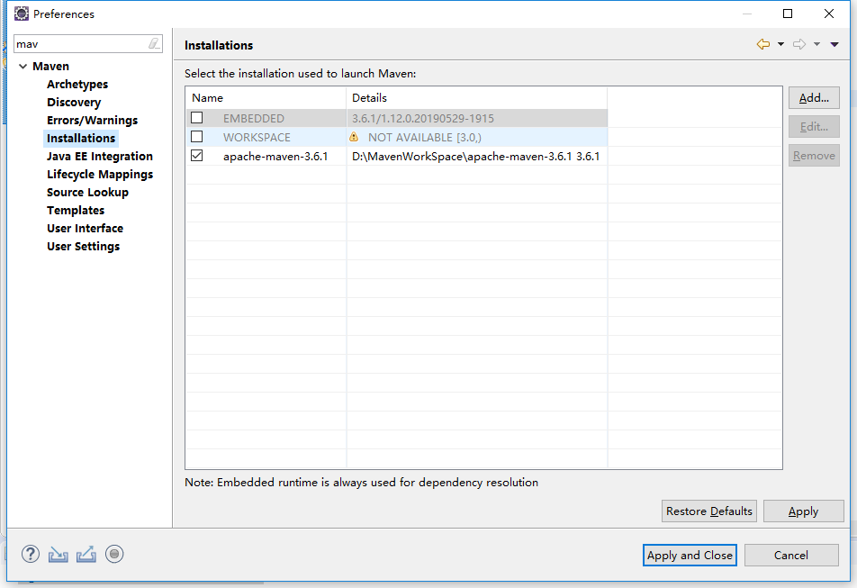
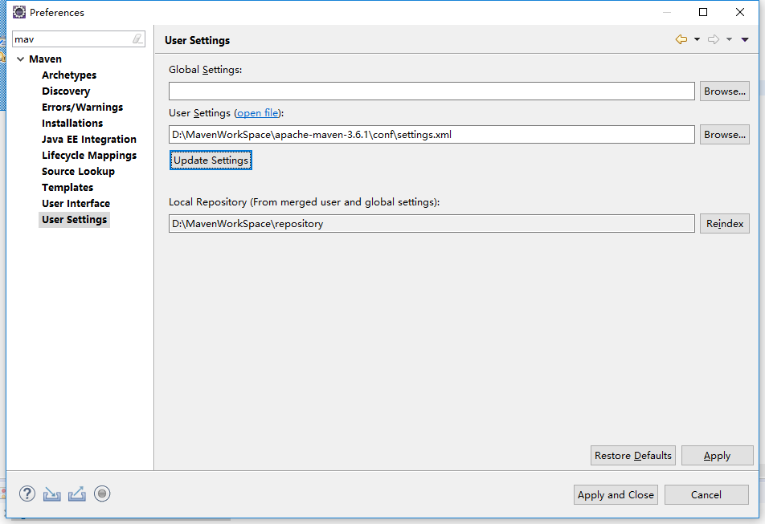

# 安装

## 环境配置

JDK: 1.8+

MAVEN: 3.0+

Mysql / Oracle

Eclipse Java EE IDE for Web Developers.Version: Mars.1 Release (4.5.1)

## 下载项目

```bash
git clone https://github.com/APIJSON/APIJSON-Demo.git
```

或者，直接下载ZIP打包好的项目文件。


## 导入项目

Eclipse 导入：

顶部菜单 File > Import > Maven > Existing Maven Projects > Next > Browse

[APIJSON-Demo-Master/APIJSON-Java-Server/APIJSONDemo](https://github.com/APIJSON/APIJSON-Demo/tree/master/APIJSON-Java-Server/APIJSONDemo)

报依赖错误的时候，同目录下的`lib`里面的`jar`添加到`Build Path`中。


为了方便修改源代码，你可以像我一样不添加`libs/apijson-orm.jar`文件到`Build Path`中。而是`libs/apijson-orm.jar`的源码，复制到当前项目里。

源代码在 <br >
https://github.com/Tencent/APIJSON/tree/master/APIJSONORM

## 错误修改

有可能 pom.xml 会报错，例如：

```java
<project xmlns="http://maven.apache.org/POM/4.0.0" xmlns:xsi="http://www.w3.org/2001/XMLSchema-instance"
	xsi:schemaLocation="http://maven.apache.org/POM/4.0.0 http://maven.apache.org/xsd/maven-4.0.0.xsd">
```

这段代码中的这一句提示错误：

```java
xsi:schemaLocation="http://maven.apache.org/POM/4.0.0 http://maven.apache.org/xsd/maven-4.0.0.xsd">
```

修改步骤：

- 请修改 Eclipse 中的 Maven 镜像地址，以便更快下载或者更新，具体方法自行百度；
- 打开 Eclipse->Windows->Preferences->Maven->Installations->add 这个按钮用于指定 maven 的安装目录。这里不建议使用 eclipse 自带的，需要再自己设置。最终效果如下图所示：
  
- 打开 Eclipse->Windows->Preferences->Maven->User Settings 这是指定 setting.xml 的位置，同时导向自己的本地 maven 仓库。最终效果如下图所示：
  

以上截图仅为示例，实际路径请以自己设定为准。
