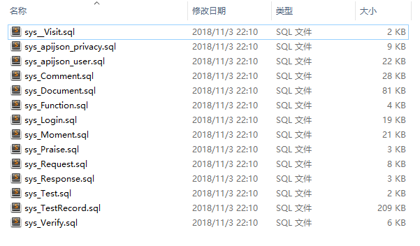

# 数据库

以下是基于 Mysql 数据库的开发流程示例

## 配置

如我的数据库信息是这样的

| 数据库参数 | 值                  |
| ---------- | ------------------- |
| 地址       | 192.168.71.146:3306 |
| 用户       | root                |
| 密码       | root                |
| 数据库     | thea                |

那么需要在`DemoSQLConfig`，40-61行，改为自己数据库对应的链接

```java
	static {
		DEFAULT_DATABASE = DATABASE_MYSQL;  // TODO 默认数据库类型，改成你自己的
		DEFAULT_SCHEMA = "sys";  // TODO 默认数据库名/模式，改成你自己的，默认情况是 MySQL: sys, PostgreSQL: public, SQL Server: dbo, Oracle: 
	}
	
	@Override
	public String getDBVersion() {
		return "5.7.22";  // "8.0.11";  // TODO 改成你自己的 MySQL 或 PostgreSQL 数据库版本号  // MYSQL 8 和 7 使用的 JDBC 配置不一样
	}
	
	@JSONField(serialize = false)  // 不在日志打印 账号/密码 等敏感信息
	@Override
	public String getDBUri() {
		// 这个是 MySQL 8.0 及以上，要加 userSSL=false  return "jdbc:mysql://localhost:3306?userSSL=false&serverTimezone=GMT%2B8&useUnicode=true&characterEncoding=UTF-8";
		// 以下是 MySQL 5.7 及以下
		return "jdbc:mysql://localhost:3306?serverTimezone=GMT%2B8&useUnicode=true&characterEncoding=UTF-8"; //TODO 改成你自己的，TiDB 可以当成 MySQL 使用，默认端口为 4000
	}
	
	@JSONField(serialize = false)  // 不在日志打印 账号/密码 等敏感信息
	@Override
	public String getDBAccount() {
		return "root";  // TODO 改成你自己的
	}
	
	@JSONField(serialize = false)  // 不在日志打印 账号/密码 等敏感信息
	@Override
	public String getDBPassword() {
		return "apijson";  // TODO 改成你自己的，TiDB 可以当成 MySQL 使用， 默认密码为空字符串 ""
	}
```

具体见源码 <br >
https://github.com/APIJSON/APIJSON-Demo/blob/master/APIJSON-Java-Server/APIJSONDemo/src/main/java/apijson/demo/DemoSQLConfig.java


## 导入表

在 [APIJSON-Demo-Master/MySQL](https://github.com/APIJSON/APIJSON-Demo/tree/master/MySQL) 目录下有一批SQL脚本，他们看起来是这样的



导入完成之后。我们可以把项目跑起来看下，以刚刚配置的项目，项目是否能够连上数据库。其中也有一些初始化数据，可以方便我们测试。
